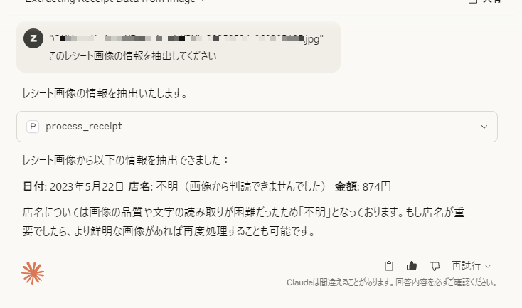

# 領収書処理サーバー for zztkm

zztkm のための領収書処理サーバーです。

## Requirements

- [Ollama](https://ollama.com/)

### Ollama で利用するモデル

現在このツールが利用するモデルはデフォルトで以下のようになってます。

- CLI
  - `gemma3:12b`
  - CLI 引数 `--model` で変更可能
- MCP サーバー
  - `gemma3:12b`
  - 指定不可

## Install

```bash
uv tool install git+https://github.com/zztkm/ryousyusyo-syori
```

2 つのツールがインストールされます。

- `ryousyusyo`: 領収書の画像を処理する CLI ツール
- `ryousyusyo-server`: 領収書画像処理を行う MCP サーバー

## Usage

CLI ツール
```bash
uvx --from ryousyusyo-syori ryousyusyo --help
```

MCP サーバーを起動するには以下のコマンドを実行します (stdio モードで実行されます)。
```bash
uvx --from ryousyusyo-syori ryousyusyo-server
```

### Usage for Claude Desktop

Claude Desktop で使用する場合は、以下のように MCP サーバーを設定します（Install の章で説明したように、`ryousyusyo-syori` をインストールしていることが前提です）。

`claude_desktop_config.json`

```json
{
  "mcpServers": {
    "receiptProcessor": {
      "command": "uvx",
      "args": [
        "--from",
        "ryousyusyo-syori",
        "ryousyusyo-server"
      ]
    }
  }
}
```

これを設定後、Claude Desktop を再起動します。

そうすると、MCP サーバーを認識した状態になるため、以下のようなプロンプトを入力して領収書情報を抽出できます。

※ 画像パスは絶対パスで指定してください。

```txt
"C:\Users\you\Downloads\test.jpg"
このレシート画像の情報を抽出してください
```



## Reference

- [TypeScript で MCP サーバーを実装し、Claude Desktop から利用する](https://azukiazusa.dev/blog/typescript-mcp-server)
- [Welcome to FastMCP 2.0! - FastMCP](https://gofastmcp.com/getting-started/welcome)
- [ollama/ollama-python: Ollama Python library](https://github.com/ollama/ollama-python)
